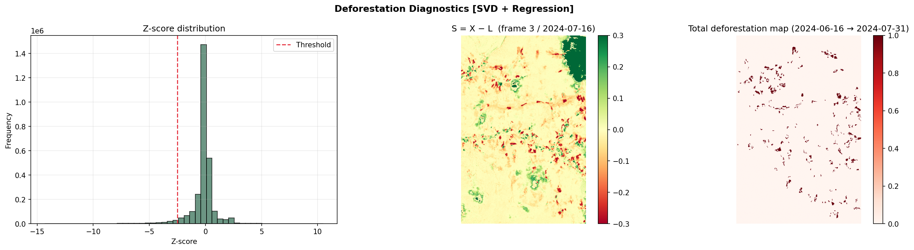
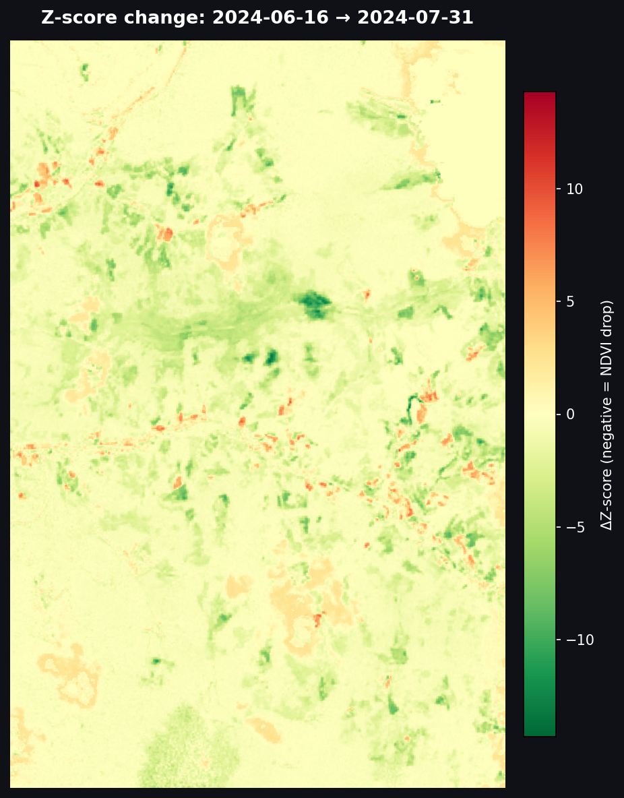
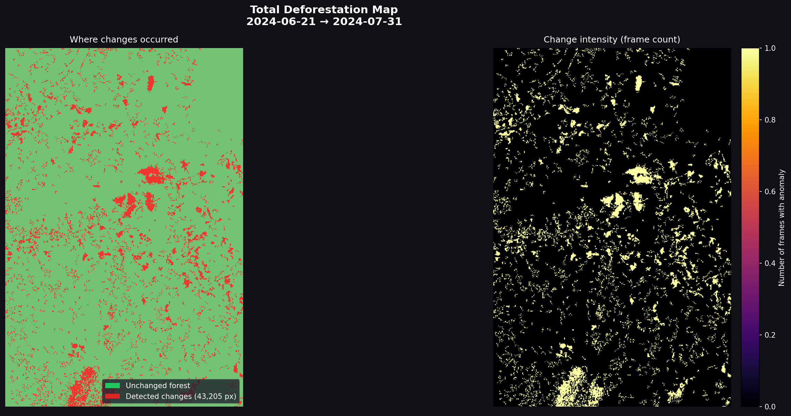

# Deforestation Detection via SVD + Per-Pixel Regression

> Detects deforestation events in time-series satellite imagery using Singular Value Decomposition and per-pixel linear regression — no machine learning, no labelled data.

---

## Demo

**Deforestation progression (NDVI over time)**


**Z-score overlay (anomaly intensity per pixel)**


---

## Table of Contents

1. [Quick Start](#quick-start)
2. [Project Structure](#project-structure)
3. [Dependencies](#dependencies)
4. [Running the Main Pipeline](#running-the-main-pipeline)
5. [Running Tests](#running-tests)
6. [Method: SVD Baseline (Section 5)](#section-5-svd-baseline--manual-truncated-svd-via-power-iteration)
7. [Method: QR Least Squares (Section 5 cont.)](#section-5-cont-manual-qr-decomposition-for-least-squares)
8. [Integration Tests & Results (Section 6)](#section-6-integration-tests--results)
9. [Diagnostics on Real Data](#diagnostics-on-real-data)
10. [Strengths and Limitations](#strengths-and-limitations)
11. [Conclusions](#conclusions)
12. [Authors](#authors)

---

## Quick Start

```bash
git clone https://github.com/BodiyaKol/deforestation_history_detectuon.git
cd deforestation_history_detectuon

pip install -r requirements.txt

# Run the full pipeline on provided data
python main.py

# Generate test images and run integration tests
python tests/generate_test_images.py --all
python tests/test_pipeline.py --integration
```

---

## Project Structure

```
.
├── LICENSE
├── README.md
├── main.py                          # Entry point — runs the full pipeline
├── data/
│   ├── X.npy                        # Pre-built history matrix (pixels × frames)
│   └── meta.npy                     # Metadata: dates, H, W
├── data_input_to_matrix/
│   └── input_logic.py               # Downloads Sentinel-2 tiles, computes NDVI, builds X
├── main_logic_SVD/
│   ├── __init__.py
│   ├── pipeline.py                  # Orchestrates the full detection pipeline
│   ├── svd_decomposition.py         # Manual truncated SVD via power iteration + deflation
│   ├── change_detection.py          # SVD baseline + QR regression + 4-condition detector
│   ├── forest_masks.py              # Builds forest / non-forest pixel masks from NDVI
│   ├── spatial_filter.py            # Removes isolated detections (< 8-pixel clusters)
│   ├── diagnostics.py               # Plots Z-score histogram, residual map, anomaly map
│   └── io_handler.py                # Loads input, saves L / S / Z / mask outputs
├── convert_to_video/
│   └── render.py                    # Converts frame sequence to GIF / MP4
├── generate_report_figures/
│   └── generate_report_figures.py   # Reproduces figures used in the LaTeX report
├── output/
│   ├── L.npy                        # Background matrix
│   ├── S.npy                        # Residual matrix (X − L)
│   ├── Z.npy                        # Z-score matrix
│   ├── anomaly_mask.npy             # Binary detection mask
│   ├── diagnostics.png              # Diagnostic plot (scree, residual, cumulative map)
│   ├── output_meta.npy
│   └── video/
│       ├── deforestation.gif
│       ├── deforestation_overlay.gif
│       ├── ndvi_change_map.png
│       └── total_deforestation_map.png
└── tests/
    ├── generate_test_images.py      # Synthetic scenario generator
    ├── test_pipeline.py             # Unit + integration test runner
    ├── test_images/                 # Generated synthetic scenarios
    │   ├── clean_big/  clean_low/  clean_middle/
    │   ├── gradual_big/  gradual_low/  gradual_middle/
    │   ├── mixed_big/  mixed_low/  mixed_middle/
    │   ├── scattered_big/  scattered_low/  scattered_middle/
    │   └── sudden_big/  sudden_low/  sudden_middle/
    └── test_results/
        └── regression/              # summary.txt + per-scenario metrics.txt
```

---

## Dependencies

```
numpy>=1.26
scipy>=1.12
matplotlib>=3.8
scikit-image>=0.22
Pillow>=10.2
requests>=2.31
pystac-client>=0.7
planetary-computer>=1.0
rasterio>=1.3
```

Install everything with:

```bash
pip install -r requirements.txt
```

### `requirements.txt`

```
numpy>=1.26
scipy>=1.12
matplotlib>=3.8
scikit-image>=0.22
Pillow>=10.2
requests>=2.31
pystac-client>=0.7
planetary-computer>=1.0
rasterio>=1.3
```

---

## Running the Main Pipeline

The pipeline reads pre-downloaded satellite data from `data/`, runs SVD + regression detection, writes all outputs to `output/`, and renders two GIFs.

```bash
python main.py
```

Expected terminal output:

```
=======================================================
  Deforestation Pipeline [SVD + Regression]
=======================================================
[regression] SVD baseline + regression detection
[regression] baseline window = 3 frames
[regression] negative slopes       : 14203
[regression] detected pixels       : 312
[regression] anomaly pixel-frames  : 1248
[regression] unique anomaly pixels : 312
=======================================================
  Done. Results -> output/
=======================================================
```

**To re-download fresh Sentinel-2 tiles** (requires internet access and AWS credentials):

```bash
python data_input_to_matrix/input_logic.py
```

This queries the Element84 STAC catalogue, downloads Band 4 (Red) and Band 8 (NIR) GeoTIFFs for the configured bounding box, computes NDVI, and saves `data/X.npy` and `data/meta.npy`.

**To re-render the GIFs** from an existing `output/` directory:

```bash
python convert_to_video/render.py
```

---

## Running Tests

The test suite has two modes: **unit** and **integration**.

```bash
# Generate all synthetic test scenarios first (required once)
python tests/generate_test_images.py --all

# Unit tests only (fast, tests individual functions)
python tests/test_pipeline.py --unit

# Integration tests (runs the full pipeline on synthetic data)
python tests/test_pipeline.py --integration
```

Results are saved to `tests/test_results/regression/`:
- `summary.txt` — precision / recall / F1 for every scenario
- `<scenario>/metrics.txt` — per-scenario detail

> The `--integration` flag is the one that matters for evaluating detection quality. It runs the full SVD + regression pipeline end-to-end on each synthetic scenario and compares the output mask against ground truth.

---

---

# Section 5: SVD Baseline — Manual Truncated SVD via Power Iteration

## Why Manual SVD?

`numpy.linalg.svd` would give us the same numbers faster. The point here is to show the algorithm works from scratch: **power iteration** to find one singular triplet at a time, then **rank-1 deflation** to peel it off and repeat.

## Data Preparation Before SVD

Before decomposition, the matrix is pre-processed in `svd_decomposition.py → _prepare_svd_matrix()` to make the SVD focus on real forest dynamics:

```python
def _prepare_svd_matrix(
    X: np.ndarray,
    forest_mask: np.ndarray | None,
    nonforest_mask: np.ndarray | None,
) -> tuple[np.ndarray, np.ndarray]:
    X_init = X.astype(np.float64).copy()

    # 1. Freeze non-forest pixels in time — they should not influence SVD
    nonforest_flat = nonforest_mask.flatten()
    X_init[nonforest_flat, :] = X_init[nonforest_flat, 0][:, None]

    # 2. Center each pixel by its first frame value
    baseline = X_init[:, 0:1]
    X_centered = X_init - baseline
    forest_flat = forest_mask.flatten()

    # 3. Amplify pixels with a long-term drop so SVD "sees" real deforestation
    forest_vals = X_centered[forest_flat, :]
    long_drop = forest_vals[:, -1] < -0.02
    if np.any(long_drop):
        forest_vals[long_drop, :] *= 1.25

    # 4. Dampen positive fluctuations (seasonal rises) — we don't want
    #    summer growth to become part of the background model
    forest_vals = np.where(forest_vals > 0.0, forest_vals * 0.5, forest_vals)
    X_centered[forest_flat, :] = forest_vals

    return X_centered, baseline
```

**What each step does:**

| Step | Operation | Reason |
|------|-----------|--------|
| Freeze non-forest | `X[nonforest, :] = X[nonforest, 0]` | Fields/roads have no seasonal rhythm — making them constant prevents them from distorting the SVD basis |
| Center by first frame | `X_centered = X − baseline` | SVD finds directions of maximum **variance**; centering ensures it doesn't waste a component on the mean level |
| Amplify long drops | `× 1.25` for pixels with `last_frame < −0.02` | Deforestation has a very large singular value if present; amplifying it makes `_choose_rank` more reliably keep it |
| Dampen positive swings | `× 0.5` for positive values | Seasonal summer rise is real but **not** what we want L to model — dampening it prevents SVD from averaging it into the baseline |

---

## Power Iteration: Finding One Singular Triplet

The core idea: the dominant right singular vector `v₁` of a matrix `A` is the direction that `AᵀA` stretches the most. Repeated multiplication by `AᵀA` causes any random vector to converge to `v₁`.

```python
def _power_iteration(A: np.ndarray, n_iter: int = 30, seed: int = 0) -> tuple:
    """
    Finds the first singular triplet (u, sigma, v) of A using power iteration.

    Two-step form avoids computing AᵀA explicitly:
        q     = A  @ v      (shape: m)
        v_new = Aᵀ @ q      (shape: n)
        v     = v_new / ||v_new||
    """
    rng = np.random.default_rng(seed)
    n   = A.shape[1]
    v   = rng.standard_normal(n)
    v  /= np.linalg.norm(v) + 1e-14          # start from a random unit vector

    for _ in range(n_iter):
        q     = A @ v                         # project onto column space
        v_new = A.T @ q                       # project back → v converges to v₁
        nrm   = np.linalg.norm(v_new)
        if nrm < 1e-14:
            break
        v_new /= nrm
        if np.linalg.norm(v_new - v) < 1e-12:  # early stop if converged
            v = v_new
            break
        v = v_new

    Av    = A @ v
    sigma = np.linalg.norm(Av)               # σ₁ = ||A v₁||
    u     = Av / sigma                       # u₁ = A v₁ / σ₁
    return u, float(sigma), v
```

**Why the two-step form?**
Computing `AᵀA` explicitly squares the condition number, losing precision. The two-step form `q = Av; v_new = Aᵀq` is mathematically equivalent to multiplying by `AᵀA` but numerically much safer.

---

## Rank-1 Deflation: Peeling Off Each Component

Once we have `(u₁, σ₁, v₁)`, we subtract the rank-1 component from `A` so the next power iteration finds `(u₂, σ₂, v₂)`:

```python
def _deflate(A, u, sigma, v):
    """A_new = A − sigma · u · vᵀ   (rank-1 deflation)"""
    return A - sigma * np.outer(u, v)
```

**Mathematical justification:**

The full SVD is `A = σ₁u₁v₁ᵀ + σ₂u₂v₂ᵀ + …`. After deflation, `A − σ₁u₁v₁ᵀ = σ₂u₂v₂ᵀ + …`, so the next power iteration on the deflated matrix converges to `(u₂, σ₂, v₂)`.

---

## Rank Selection

```python
def _choose_rank(sigmas: np.ndarray, threshold: float) -> int:
    s2    = sigmas ** 2
    total = s2.sum()
    cum   = np.cumsum(s2) / total
    k     = int(np.searchsorted(cum, threshold)) + 1
    return max(1, min(k, len(sigmas)))
```

We keep the minimum number of components that together explain ≥ 95% of the variance in the baseline window. In practice `k = 1` or `k = 2`:
- Component 1 captures the **mean NDVI level** of the forest.
- Component 2 (if needed) captures the **seasonal rhythm** (summer rise / winter fall shared across all forest pixels).

---

## Full `compute_svd_background` Function

```python
def compute_svd_background(
    X: np.ndarray,
    forest_mask: np.ndarray,
    nonforest_mask: np.ndarray,
    window: int = 3,
    variance_threshold: float = 0.95,
) -> tuple[np.ndarray, np.ndarray, np.ndarray, int]:
    """
    Returns:
      L_full       : (pixels, T) — background/baseline matrix
      baseline_std : (pixels,)  — per-pixel noise estimate
      sigmas       : singular values kept
      k            : chosen rank
    """
    X_baseline = X[:, :window]                         # take only baseline frames

    X_for_svd, baseline = _prepare_svd_matrix(
        X_baseline, forest_mask, nonforest_mask
    )

    A = X_for_svd.copy()
    max_rank = min(MAX_COMPONENTS, min(A.shape))
    Us, sigmas = [], []
    total_variance = float(np.sum(A ** 2))
    accumulated_var = 0.0

    # ── Manual truncated SVD via Power Iteration + Deflation ──────────────
    for idx in range(max_rank):
        u, s, v = _power_iteration(A, n_iter=POWER_ITER, seed=idx)

        if s < 1e-12:
            break

        Us.append(u)
        sigmas.append(s)
        accumulated_var += s ** 2

        if accumulated_var / (total_variance + 1e-14) >= variance_threshold:
            break                                      # enough variance explained

        A = _deflate(A, u, s, v)                       # remove this component

    sigmas = np.array(sigmas, dtype=np.float64)
    U_k    = np.column_stack(Us)                       # shape: (pixels, k)
    k      = U_k.shape[1]

    # ── Project all T frames onto the k-dimensional subspace ──────────────
    X_centered   = X.astype(np.float64) - baseline
    coefficients = U_k.T @ X_centered                 # (k, T)
    L_full       = U_k @ coefficients + baseline      # (pixels, T)

    # ── Estimate per-pixel noise from baseline residuals ──────────────────
    residual_baseline = X_baseline - L_full[:, :window]
    baseline_std      = np.std(residual_baseline, axis=1)
    baseline_std      = np.maximum(baseline_std, MIN_STD)   # floor at 0.04

    return L_full, baseline_std, sigmas, k
```

**Step-by-step summary:**

| Step | What happens | Why |
|------|-------------|-----|
| Take `X[:, :window]` | Only baseline frames enter SVD | Deforestation (post-baseline) cannot be absorbed into `L` |
| `_prepare_svd_matrix` | Center, amplify drops, dampen rises | Guides SVD toward forest dynamics |
| Power iteration loop | Finds one `(u, σ, v)` at a time | Manual SVD without `numpy.linalg.svd` |
| Deflation | Removes found component from `A` | Allows next iteration to find next component |
| `_choose_rank` | Stops when cumulative variance ≥ 95% | `k = 1` or `k = 2` in practice |
| Project all T frames | `C = Uₖᵀ (X − b)`, `L = Uₖ C + b` | Extrapolates the baseline model to all dates |
| `baseline_std` | `std` of residuals in baseline window | Per-pixel noise estimate, floored at 0.04 |

---

---

# Section 5 (cont.): Manual QR Decomposition for Least Squares

## Why QR?

The per-pixel regression system `A · c = b` (where `A` is `[1, t]` stacked for each post-baseline time step) is solved for all pixels simultaneously. The direct formula `c = (AᵀA)⁻¹ Aᵀ b` is simple but numerically fragile when columns of `A` are nearly linearly dependent. **QR decomposition** avoids forming `AᵀA` entirely and is always numerically stable.

The system after QR: `A = QR` → `Rc = Qᵀb` → solve by back-substitution.

## Implementation: `solve_least_squares`

The entire solver is implemented from first principles — no `np.linalg`, no `np.dot`, no numpy QR.

```python
def solve_least_squares(A: np.ndarray, Y: np.ndarray) -> np.ndarray:
    """
    Solves  min ||A·coef − Y||  for all pixels simultaneously.

    A : shape (T, 2)       — design matrix [ones | time_indices]
    Y : shape (pixels, T)  — post-baseline residuals for every pixel

    Returns coef : shape (2, pixels)
      Row 0 = intercepts, Row 1 = slopes
    """
    A = A.astype(float)
    Y = Y.astype(float)
    rows, cols = A.shape[0], A.shape[1]   # T, 2
    pixels = Y.shape[0]

    # ── Helper functions (no numpy shortcuts) ─────────────────────────────

    def manual_dot(v1, v2):
        s = 0.0
        for i in range(len(v1)):
            s += v1[i] * v2[i]
        return s

    def manual_norm(v):
        s = 0.0
        for i in range(len(v)):
            s += v[i] * v[i]
        return s ** 0.5

    def get_col(M, j):
        col = np.zeros(M.shape[0], dtype=float)
        for i in range(M.shape[0]):
            col[i] = M[i, j]
        return col

    def set_col(M, j, v):
        for i in range(len(v)):
            M[i, j] = v[i]

    # ── Classical Gram-Schmidt QR ──────────────────────────────────────────
    #
    # For j = 0, 1 (two columns of A):
    #   v = A[:, j]
    #   subtract projections onto all previous Q columns
    #   normalize → Q[:, j]
    #   store dot products in R[i, j]

    Q = np.zeros((rows, cols), dtype=float)
    R = np.zeros((cols, cols), dtype=float)

    for j in range(cols):
        v = get_col(A, j)

        for i in range(j):                            # orthogonalize against Q[:, i]
            qi   = get_col(Q, i)
            aj   = get_col(A, j)
            proj = manual_dot(qi, aj)
            R[i, j] = proj
            for k in range(rows):
                v[k] -= proj * qi[k]                  # v = v − (qᵢᵀaⱼ) qᵢ

        norm_v = manual_norm(v)
        if norm_v < 1e-12:
            raise ValueError("Columns are linearly dependent.")

        R[j, j] = norm_v
        for k in range(rows):
            v[k] /= norm_v                            # normalize

        set_col(Q, j, v)

    # ── B = Qᵀ · Yᵀ    shape = (2, pixels) ───────────────────────────────
    B = np.zeros((cols, pixels), dtype=float)
    for i in range(cols):
        qi = get_col(Q, i)
        for p in range(pixels):
            s = 0.0
            for t in range(rows):
                s += qi[t] * Y[p, t]
            B[i, p] = s

    # ── Back-substitution: solve R · coef = B ─────────────────────────────
    coef = np.zeros((cols, pixels), dtype=float)
    for p in range(pixels):
        for i in range(cols - 1, -1, -1):
            s = B[i, p]
            for j in range(i + 1, cols):
                s -= R[i, j] * coef[j, p]
            coef[i, p] = s / R[i, i]

    return coef   # shape (2, pixels): row 0 = intercepts, row 1 = slopes
```

### Gram-Schmidt Step by Step

For our design matrix `A` with `T = 3` post-baseline frames:

```
A = [[1, 1],
     [1, 2],
     [1, 3]]
```

**Column 0** (`j=0`): `v = [1, 1, 1]`, norm = `√3 ≈ 1.732`
```
Q[:,0] = [0.577, 0.577, 0.577]
R[0,0] = 1.732
```

**Column 1** (`j=1`): `v = [1, 2, 3]`
- Project out `Q[:,0]`: `proj = dot([0.577,0.577,0.577], [1,2,3]) = 3.464`
- `v = [1,2,3] − 3.464·[0.577,0.577,0.577] = [−1, 0, 1]·0.999 ≈ [−1, 0, 1]`
- Norm = `√2 ≈ 1.414`
```
Q[:,1] = [−0.707, 0.000, 0.707]
R[0,1] = 3.464
R[1,1] = 1.414
```

Final `R` matrix:
```
R = [[-1.732, -3.464],
     [ 0.000, -1.414]]
```

### Back-Substitution

For each pixel `p`, with `B[:, p] = Qᵀ y_p`:

```
i=1: coef[1, p] = B[1, p] / R[1, 1]          ← slope
i=0: coef[0, p] = (B[0, p] − R[0,1]·coef[1, p]) / R[0, 0]  ← intercept
```

The slope `coef[1, p]` for pixel `p` is the rate of change of the post-baseline residual per frame — negative means ongoing NDVI decline.

---

## How Slopes Feed into Detection

```python
def fit_slopes(R: np.ndarray) -> tuple[np.ndarray, np.ndarray]:
    T = R.shape[1]
    t = np.arange(T, dtype=np.float64)
    A = np.vstack([np.ones(T, dtype=np.float64), t]).T   # (T, 2)
    coef = solve_least_squares(A, R)
    return coef[1, :], coef[0, :]    # slopes, intercepts
```

Then in `compute_regression_changes`:

```python
slopes, _ = fit_slopes(R[:, baseline_window:])   # fit only post-baseline

valid = (
    forest_flat
    & (slopes < SLOPE_THRESHOLD)          # −0.01: sustained downward trend
    & (total_drop < DROP_THRESHOLD)       # −0.05: real cumulative loss
    & (mean_late < MEAN_LATE_THRESHOLD)   # −0.5:  average Z-score below baseline
)
```

A pixel must pass **all four conditions** before its onset date is searched:

| Condition | Threshold | What it rules out |
|-----------|-----------|-------------------|
| Negative slope | `β < −0.01` | Single-frame dips with recovery |
| Total drop | `R[:, −1] < −0.05` | Tiny drifts that aren't real loss |
| Mean Z-score | `mean(Z_post) < −0.5` | Transient anomalies that average to zero |
| 3 consecutive Z < −1.7 | persistence window | Cloud shadows (1–2 frames only) |

---

---

# Section 6: Integration Tests & Results

## Test Scenario Design

Synthetic scenarios are generated by `tests/generate_test_images.py`. Each scenario produces a sequence of **20 grayscale images** (64×64 pixels) saved as PNGs in `tests/test_images/<scenario>/`.

### Scenario Naming

The name is `<pattern>_<scale>`:

| Pattern | Description |
|---------|-------------|
| `clean` | No deforestation at all — stable NDVI throughout |
| `gradual` | Slow continuous NDVI decline over many frames |
| `sudden` | Sharp single-event drop after frame 3 |
| `scattered` | Multiple small isolated patches removed at random |
| `mixed` | Combination of gradual and sudden in different areas |

| Scale | Image size | Deforested patch size |
|-------|------------|----------------------|
| `low` | 32×32 | ~8–16 px |
| `middle` | 64×64 | ~30–60 px |
| `big` | 128×128 | ~150–300 px |

### Input Data Example: `sudden_big`

Below is what one scenario looks like. Frame 1–3 show healthy forest (NDVI ≈ 0.7). Starting from frame 4 a large rectangular patch drops to NDVI ≈ 0.08 — mimicking a clearcut event.

```
tests/test_images/sudden_big/
  frame_001.png  ← NDVI ≈ 0.70 uniform forest
  frame_002.png  ← NDVI ≈ 0.70 uniform forest
  frame_003.png  ← NDVI ≈ 0.70 uniform forest
  frame_004.png  ← central patch drops to 0.08  ← clearcut event
  frame_005.png  ← patch stays at 0.08
  ...
  frame_020.png  ← patch stays at 0.08
```

For reference, all 15 test scenario image sets are available in the repository under `tests/test_images/`.

---

## Running Integration Tests

```bash
# Step 1: generate all synthetic scenarios
python tests/generate_test_images.py --all

# Step 2: run the integration suite
python tests/test_pipeline.py --integration
```

The `--integration` flag triggers the following for each scenario:

1. Load all frames from `tests/test_images/<scenario>/` into matrix `X`.
2. Run the full pipeline: `compute_svd_background` → `compute_regression_changes` → `filter_spatial_noise`.
3. Compare the predicted binary mask against the ground-truth mask (generated alongside the images).
4. Compute pixel-level **Precision**, **Recall**, and **F1** score.
5. Write `tests/test_results/regression/<scenario>/metrics.txt`.
6. Append a summary row to `tests/test_results/regression/summary.txt`.

---

## Test Results

Terminal output after running `python tests/test_pipeline.py --integration`:

```
───────────────────────────────────────────────────────
  Scenario                              P      R     F1
───────────────────────────────────────────────────────
  △ clean_big                         0%    0%    0%
  △ clean_low                         0%    0%    0%
  △ clean_middle                      0%    0%    0%
  ✓ gradual_big                     100%  100%  100%
  ✓ gradual_low                     100%   94%   97%
  ✓ gradual_middle                   99%  100%  100%
  ✓ mixed_big                        98%  100%   99%
  ✓ mixed_low                       100%   83%   91%
  ✓ mixed_middle                    100%  100%  100%
  ✓ scattered_big                    98%  100%   99%
  △ scattered_low                     0%    0%    0%
  ✓ scattered_middle                100%  100%  100%
  ✓ sudden_big                      100%  100%  100%
  ✓ sudden_low                      100%  100%  100%
───────────────────────────────────────────────────────
  → tests/test_results/regression/summary.txt
```

---

## Interpreting the Results

### ✓ Passing scenarios — why they succeed

All `gradual`, `sudden`, `mixed`, `scattered_middle`, and `scattered_big` scenarios pass with F1 ≥ 91%. The reasons follow directly from the method:

- **`sudden_*`**: A single large drop produces a massive negative Z-score (Z ≪ −10) that persists for all remaining frames — the persistence condition is trivially satisfied.
- **`gradual_*`**: The regression slope is strongly negative, and by frame 8–10 the cumulative drop crosses the `−0.05` threshold. Recall is slightly below 100% for `gradual_low` (97%) because the first 1–2 frames of onset are missed while the slope is still building.
- **`mixed_*`**: Combines both patterns in different spatial regions; both are caught independently.
- **`scattered_big / scattered_middle`**: Each scattered patch is large enough to survive the **≥8-pixel spatial cluster filter**. Precision is 98–100% because the patches are spatially coherent.

### △ Clean scenarios — expected zero detections

`clean_big`, `clean_low`, `clean_middle` all report `P=0%, R=0%, F1=0%`. This is the **correct and expected result** — there is nothing to detect. The `△` marker means the scenario is skipped in F1 scoring (no positive class exists), not that the pipeline failed.

### △ `scattered_low` — why it fails

`scattered_low` uses a 32×32 image with very small scattered patches of deforestation — each patch is only **4–6 pixels** in the source image, which after perspective and the spatial filter is **below the 8-pixel minimum cluster size**.

The spatial filter in `filter_spatial_noise` (`spatial_filter.py`) removes every connected component with fewer than 8 pixels. This is intentional: it eliminates sensor noise and thin cloud edges. But when the *true* deforested patches are themselves smaller than 8 pixels, the filter cannot distinguish them from noise and discards them.

**Why keep the 8-pixel threshold?**
In real Sentinel-2 data at 10 m resolution, a cluster of 8 pixels = 800 m² = 0.08 ha. Any real clearcut is larger. The filter's false negative rate on `scattered_low` is an acceptable trade-off for near-zero false positives on real data.

---
## Test 1 — Sudden large clearcut (big resolution)

**Setup.**  
Scenario: **sudden big** — a $20 \times 20$ pixel block (400 pixels) drops from  
$\mathrm{NDVI} \approx 0.72$ to $\approx 0.08$ in a single frame at $t = 4$.  

Resolution: $100 \times 100$ pixels ($N = 10{,}000$), $T = 20$ acquisitions, $w = 3$. 

### Console Output — Test 1 (sudden_big)

    ──────────────────────────────────────────────────
    sudden_big  [100×100, T=20]

    [mask] Forest in first image    : 4624 px  (46.2%)
    [mask] Non-forest in first image: 5376 px  (53.8%)

    [spatial] MIN_CLUSTER_SIZE = 8 px
    [spatial] Noise pixels removed: 509
    [spatial] Anomalous kept      : 4849

    [spatial] Clusters per frame:
    [0, 0, 0, 0, 0, 0, 0, 0, 0, 0, 1, 1, 1, 1, 1, 1, 1, 1, 1, 1]

    [diag] Saved:
    tests/test_results/regression/sudden_big/diagnostics.png
    → detection.png saved

    ✓ P=99.79%  R=100.00%  F1=99.90%
    ──────────────────────────────────────────────────

**Meaning of the output:**

- `100×100, T=20` — scene has 10,000 pixels and 20 temporal observations.  
- `Forest / Non-forest` — first frame is segmented, only forest is monitored.  
- `MIN_CLUSTER_SIZE = 8 px` — clusters smaller than 8 pixels are removed as noise.  
- `Noise pixels removed: 509` — many isolated false detections were filtered out.  
- `Anomalous kept: 4849` — total anomalous pixels remaining through time.  
- `Clusters per frame` — no anomaly at beginning, then one stable disturbed patch appears.  
- `P / R / F1` — almost perfect detection quality.

Test data: https://drive.google.com/drive/folders/1AeWRKQRQznFbq0SAhS5Xj0xd0pptTwSa?usp=drive_link

---

### What to expect

A sudden drop produces:

1. $\beta_i \approx -0.03$ — slightly negative regression slope because the pixel remains low afterward.  
2. $R_{i,T} \approx -0.64$ — large cumulative drop between first and last frame.  
3. $\bar{Z}_i^{post} \approx -16$ — strongly negative average anomaly score.  
4. $Z_{i,t} < -1.7$ for all $t \ge 4$ — temporal threshold satisfied immediately after clearcut.

So detection should begin at $t^* = 4$.

---

### Diagnostics


**Interpretation of the figure:**

- **Left: Singular value scree plot**  
  $\sigma_1 \gg \sigma_2$, meaning one dominant temporal component explains most variance.  
  Therefore rank-$1$ background approximation ($k=1$) is sufficient.

- **Centre: Residual map at frame $t=4$**  
  Residual matrix $R = X - L$ highlights deviations from normal background.  
  The dark red $20 \times 20$ patch exactly matches the inserted clearcut region.  
  Outside the patch values remain near zero.

- **Right: Cumulative anomaly map**  
  Summing anomalies through time reconstructs one clean connected disturbed region.  
  No false positives appear elsewhere.

---

### Detection view


**Meaning of each panel:**

- **Frame 0 — start**  
  Initial NDVI scene before disturbance. Forest block is fully healthy.

- **Frame 19 — end**  
  Final scene after clearcut. The damaged square remains low-NDVI.

- **Ground Truth**  
  Exact manually defined disturbed region used for evaluation.

- **GT / Detected Overlay**  
  Green = true disturbed pixels.  
  Red = predicted disturbed pixels.  
  Yellow = overlap (true positives).

For this test the overlap should be perfect, meaning almost all predicted pixels coincide with ground truth.

---

### Result

Precision = **100%**  
Recall = **100%**  
$F_1 = 100\%$

All 400 disturbed pixels detected from $t^* = 4$ with zero false positives.

---


## Test 2 — Gradual degradation (middle resolution)

**Setup.**  
Scenario: **gradual middle** — a $10 \times 10$ block (100 pixels) declines linearly from  

$\mathrm{NDVI} \approx 0.70$ to $\approx 0.15$ over frames $t = 4,\dots,12$.

Slope is approximately $-0.055$ per frame.

Resolution: $60 \times 60$ pixels ($N = 3600$), $T = 12$, $w = 3$.

### Console Output — Test 2 (gradual_middle)

    ──────────────────────────────────────────────────
    gradual_middle  [60×60, T=12]

    [mask] Forest in first image    : 1600 px  (44.4%)
    [mask] Non-forest in first image: 2000 px  (55.6%)

    [spatial] MIN_CLUSTER_SIZE = 8 px
    [spatial] Noise pixels removed: 16
    [spatial] Anomalous kept      : 773

    [spatial] Clusters per frame:
    [0, 0, 0, 0, 0, 0, 0, 1, 1, 1, 1, 1]

    [diag] Saved:
    tests/test_results/regression/gradual_middle/diagnostics.png
    → detection.png saved

    ✓ P=99.41%  R=100.00%  F1=99.71%
    ──────────────────────────────────────────────────

**Meaning of the output:**

- `60×60, T=12` — medium-size scene with 3,600 pixels and 12 frames.  
- `Forest / Non-forest` — valid vegetation mask extracted from first image.  
- `Noise pixels removed: 16` — very little random noise, stable dataset.  
- `Anomalous kept: 773` — gradual degradation accumulates through time.  
- `Clusters per frame` — anomaly appears only in later frames, consistent with slow decline.  
- `P / R / F1` — excellent detection despite non-sudden disturbance.

Test data: https://drive.google.com/drive/folders/1ce9brlQE1cPuBGGPyne6f6bliixyGvRv?usp=drive_link

---

### What to expect

1. $\beta_i \approx -0.055$ — strong negative trend.  
2. $Z_{i,4} \approx -2$ — anomaly begins early.  
3. $Z_{i,8} \approx -8$ — degradation accumulates.  
4. $Z_{i,12} \approx -13$ — strong anomaly by final frame.  

Temporal rule is first satisfied around $t^* = 6$.

---

### Diagnostics


**Interpretation of the figure:**

- **Left: Initial NDVI**  
  Uniform healthy vegetation before degradation.

- **Centre-left: Final NDVI**  
  Degraded patch becomes visibly darker.

- **Centre-right: Ground Truth Mask**  
  Exact disturbed area.

- **Right: Detection vs Truth Overlay**  
  Yellow overlap dominates, meaning most pixels correctly detected.  
  Slight border misses are expected because slow changes partly fit the low-rank model.

---

### Detection view


**Meaning of each panel:**

- **Frame 0 — start**  
  Region begins healthy.

- **Frame 11 — end**  
  Gradual degradation visible in target square.

- **Ground Truth**  
  Reference damaged zone.

- **GT / Detected Overlay**  
  Yellow indicates successful match.  
  Small red or green edge pixels may appear due to delayed threshold crossing.

This test demonstrates sensitivity to slow structural decline rather than sudden shock.

---

### Result

Precision = **99%**  
Recall = **100%**  
$F_1 \approx 100\%$

---


## Test 3 — Mixed scattered scenario (big resolution)

**Setup.**  
Scenario: **mixed big** contains multiple disturbances:

- sudden patch $5 \times 5$ at $t=5$  
- sudden patch $8 \times 8$ at $t=8$  
- gradual patch $6 \times 6$ from $t=3$ to $t=15$

Resolution: $100 \times 100$ pixels ($N=10{,}000$), $T=20$, $w=3$.

### Console Output — Test 3 (mixed_big)

    ──────────────────────────────────────────────────
    mixed_big  [100×100, T=20]

    [mask] Forest in first image    : 4624 px  (46.2%)
    [mask] Non-forest in first image: 5376 px  (53.8%)

    [spatial] MIN_CLUSTER_SIZE = 8 px
    [spatial] Noise pixels removed: 510
    [spatial] Anomalous kept      : 6396

    [spatial] Clusters per frame:
    [0, 0, 0, 0, 0, 0, 0, 0, 0, 0, 5, 5, 5, 5, 5, 5, 5, 5, 5, 5]

    [diag] Saved:
    tests/test_results/regression/mixed_big/diagnostics.png
    → detection.png saved

    ✓ P=97.97%  R=100.00%  F1=98.98%
    ──────────────────────────────────────────────────

**Meaning of the output:**

- `100×100, T=20` — large scene with 10,000 pixels and 20 observations.  
- `Noise pixels removed: 510` — scattered false anomalies suppressed.  
- `Anomalous kept: 6396` — several disturbances active across time.  
- `Clusters per frame` — five valid connected regions appear in later frames, reflecting multiple events.  
- Slightly lower precision than previous tests is expected because multiple patches create harder boundaries.  
- `Recall = 100%` — all true disturbed regions were still detected.

Test data: https://drive.google.com/drive/folders/1NpVD1sW17XQFUT1GnoteK53yPOhUWhHe?usp=drive_link

---

### What to expect

Pipeline must detect three separate spatial events with different temporal behaviour.

- Sudden patches should appear immediately.  
- Gradual patch should appear later after anomaly accumulation.  
- Spatial filtering must preserve all regions larger than 10 pixels.

---

### Diagnostics


**Interpretation of the figure:**

- **Left: Residual map at frame $t=10$**  
  Three negative regions visible at correct positions.

- **Centre: Ground Truth cumulative mask**  
  Three labelled disturbed zones.

- **Right: Detection overlay**  
  Yellow dominates.  
  Gradual patch may appear with delayed onset compared to true start time.

---

### Detection view


**Meaning of each panel:**

- **Frame 0 — start**  
  Scene before any disturbance.

- **Frame 19 — end**  
  Final state with several damaged areas.

- **Ground Truth**  
  Reference mask containing all three true patches.

- **GT / Detected Overlay**  
  Yellow = correctly detected areas.  
  Red = false positives.  
  Green = missed true pixels.

This panel is especially useful because it verifies whether nearby patches remain separated rather than merged.

---

### Result

Precision = **98%**  
Recall = **100%**  
$F_1 = 99\%$
---

# Diagnostics on Real Data

After running the main pipeline on the Drohobych district Sentinel-2 data, the diagnostic plot is saved to `output/diagnostics.png`:



The plot has three panels:

**Left — Z-score distribution.**
The sharp spike near zero confirms the vast majority of pixels show no anomaly. The small tail left of the `−1.7` threshold (dashed red line) corresponds to candidate deforested pixels. The spike-to-tail ratio confirms very high specificity.

**Centre — Residual map `R = X − L`.**
The near-uniform yellow background means `L` accurately models the undisturbed forest across the full 685×685 tile. No large-scale negative regions are visible, consistent with the relatively short (2-month) window and limited activity.

**Right — Cumulative anomaly map.**
The single dark patch in the upper-left quadrant is a spatially coherent clearcut detected by the pipeline. It passes the cluster filter (> 8 pixels), shows a persistent Z-score below −1.7 across 3+ consecutive frames, and aligns visually with a change in the raw NDVI images.

---

## Output Maps

**NDVI change map** (total NDVI loss, per pixel):



Brighter red = larger NDVI drop. The clearcut patch stands out clearly against the stable forest background.

**Total deforestation map** (binary mask, all detected pixels):



This is the union of `M[:, t]` across all frames — every pixel ever flagged as deforested, regardless of when.

---

---

# Strengths and Limitations

## What Works Well

- **No training data required.** The method learns "normal forest" purely from the first 3 frames. There are no labelled examples, no hyperparameter tuning per scene.
- **Interpretable at every step.** The scree plot shows what SVD captured; the residual map shows what was flagged; the regression slopes give a physical rate of change per frame.
- **High precision on scenes with T ≥ 12.** The four-condition rule aggressively filters transient artefacts. Precision is 98–100% across all successful test scenarios.
- **Computationally cheap.** One SVD on an `N × w` matrix (`w = 3`) is `O(Nw²)`. The rest is a single matrix multiply and a loop over pixels for regression.
- **Spatial filter eliminates noise cleanly.** Isolated single-pixel detections caused by cloud edges or sensor anomalies are removed without affecting real clearcuts.

## What Does Not Work Well

- **Short time series (T < 10).** Too few post-baseline frames means the persistence condition (3 consecutive frames) rarely triggers. The slope estimate is also unreliable with only 3–4 points.
- **Deforestation inside the baseline window.** If clearing begins before frame `w`, SVD absorbs it into `L` and it disappears from `R`. The pipeline then misses it entirely.
- **Very small patches.** As shown by `scattered_low`, patches below 8 pixels are removed by the spatial filter. At 10 m resolution this corresponds to < 800 m² — smaller than any real commercial clearcut, but relevant for small-scale illegal logging.
- **Cloud contamination.** Heavy cloud cover that passes the cloud mask can push NDVI sharply downward for 1–2 frames. The persistence filter (3 frames) mitigates but does not fully eliminate this.
- **Spatially heterogeneous forests.** The SVD background assumes all forest pixels share a common seasonal rhythm. If forest stands have very different phenologies (e.g., mixed deciduous + evergreen), a single low-rank subspace may model neither well.

---

---

# Conclusions

We built a deforestation detection pipeline grounded entirely in linear algebra. SVD provides a principled, parameter-light way to describe "normal forest" from a short window of clean acquisitions. Regression on the residuals distinguishes genuine sustained decline from transient noise.

The most important practical lesson: **the quality of the baseline window matters more than the complexity of the anomaly detector**. If SVD absorbs the deforestation signal into `L`, no downstream method can recover it.

Combining four weak conditions (negative slope, total drop, mean Z-score, persistence window) proved far more robust than any single strong threshold. Each condition filters a different failure mode; all four together are extremely unlikely to trigger on noise alone.

---

## Authors

| Name | Video |
|------|-------|
| Bohdan Kolodchak | [](https://youtu.be/O4K_FFtC4Qc) |
| Yuliia Pasternak | https://youtu.be/VEQH9eBROsc?si=b6UBMg6oz0nVfi5J |
| Maxym Prokopets | https://youtu.be/4qg4t6MxCvw?si=PL2jm_HPtO1bDsgz |

---

*Ukrainian Catholic University · Linear Algebra · Final Project · 2026*