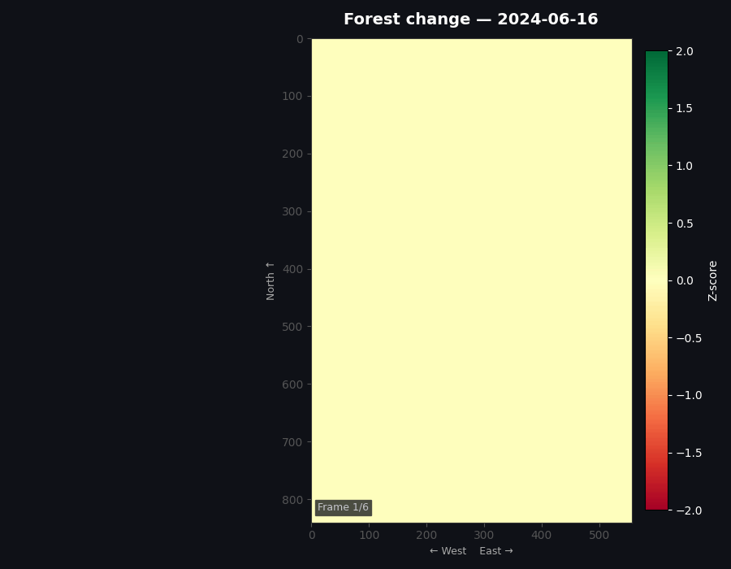
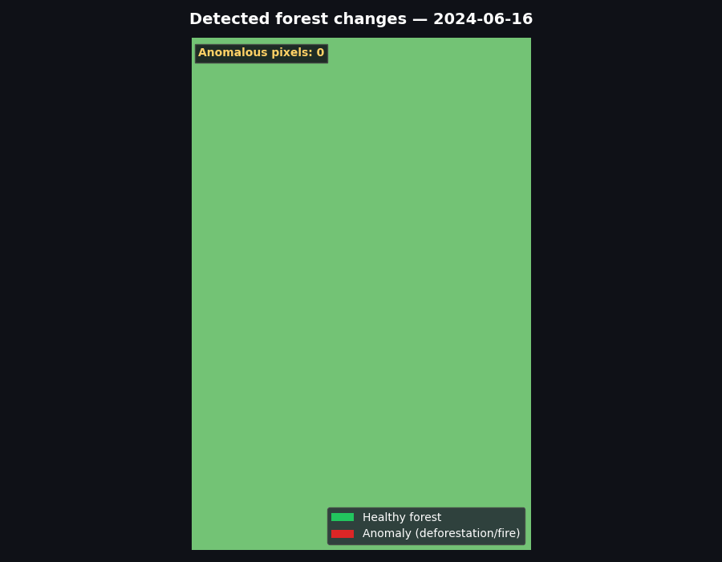

# deforestation_history_detectuon

Here we implement the algorithm to detect anomalies in historical data of a specific area, which are likely caused by deforestation.

---

## Demo
Normal deforestation

Z-score for each pixel

---

## Testing

To run tests:

1. Generate test images: `python tests/generate_test_images.py --all`
2. Run unit tests: `python tests/test_pipeline.py --unit`
3. Run integration tests: `python tests/test_pipeline.py --integration`

Results are saved in `tests/test_results/regression/` with `summary.txt` and individual `metrics.txt` files for each scenario.

---

### Video 1 (Kolodchak Bohdan)
https://youtu.be/O4K_FFtC4Qc

### Video 2 (Pasternak Yullia)
https://youtu.be/9HvxBRMIaGk

### Video 3 (Prokopets Maxym)
https://youtu.be/4qg4t6MxCvw?si=PL2jm_HPtO1bDsgz

---
